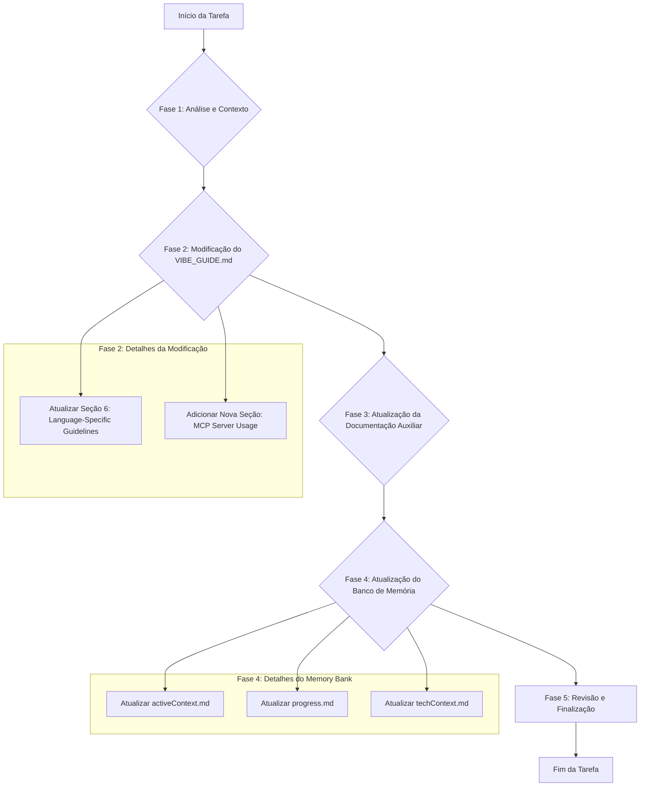

# Plano de Execução: Release v6.2 do VIBE GUIDE

O objetivo desta release é aprimorar a forma como o agente acessa diretrizes específicas de linguagens e introduzir a orientação para o uso de servidores MCP (Model Context Protocol).

---

## **Fluxo de Trabalho Proposto**

---

## **Fases Detalhadas**

### **Fase 1: Análise e Coleta de Informações (Concluída)**
*   **1.1. Leitura do Banco de Memória:** Análise dos arquivos `projectbrief.md`, `productContext.md`, `systemPatterns.md`, `techContext.md`, `activeContext.md` e `progress.md`.
*   **1.2. Leitura dos Documentos Principais:** Análise completa do `VIBE_GUIDE.md` e `README.md`.

### **Fase 2: Modificação do `VIBE_GUIDE.md`**
*   **2.1. Atualizar a Seção de Diretrizes Específicas por Linguagem:**
    *   **Local:** Seção `6. Language-Specific Guidelines`.
    *   **Mudança:** O texto será alterado para instruir o agente a **buscar dinamicamente** o conteúdo das diretrizes a partir de URLs específicas, utilizando a ferramenta `web_scrape`.
    *   **Conteúdo a ser Adicionado:** A lista de URLs fornecida será incorporada à nova instrução.

*   **2.2. Adicionar Nova Seção sobre Uso de Servidores MCP:**
    *   **Local:** Uma nova seção será criada dentro de `PART 3: VIBE - AI SOFTWARE DEVELOPMENT GUIDE`, sob `General Conventions`.
    *   **Conteúdo:** A seção irá instruir o agente a sempre utilizar os servidores MCP quando disponíveis e a solicitar autorização ao usuário caso o acesso não seja concedido previamente.

### **Fase 3: Atualização da Documentação Auxiliar**
*   **3.1. Atualizar o `README.md`:**
    *   Adicionar uma menção ao uso de servidores MCP na seção "Key Principles".

### **Fase 4: Atualização do Banco de Memória**
*   **4.1. Atualizar `memory_bank/activeContext.md`:**
    *   Refletir o foco de trabalho na implementação da v6.2 e documentar as mudanças.
*   **4.2. Atualizar `memory_bank/progress.md`:**
    *   Atualizar o status para indicar a conclusão da release v6.2 e adicionar as novas funcionalidades.
*   **4.3. Atualizar `memory_bank/techContext.md`:**
    *   Adicionar uma nova seção "MCP Server Integration" para documentar a nova diretriz.

### **Fase 5: Finalização e Próximos Passos**
*   **5.1. Revisão Final:** Realizar uma revisão completa de todos os arquivos modificados.
*   **5.2. Proposta de Implementação:** Após a aprovação deste plano, sugerir a mudança para o modo `code` para iniciar a implementação.
